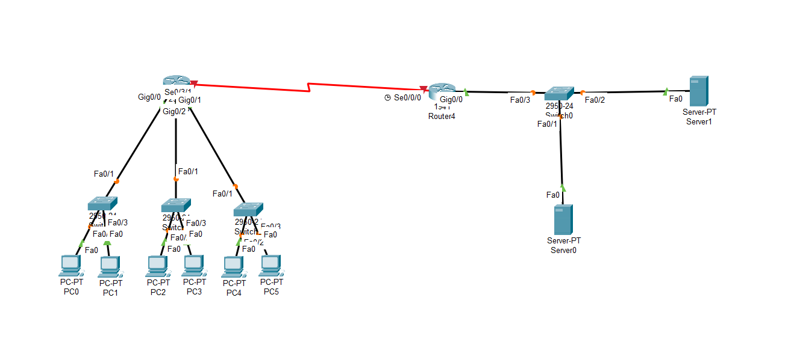

# Routing Labs

## Objective
To implement and analyze static and dynamic routing scenarios in simulated network environments.

## Technologies
- Cisco Packet Tracer
- Layer 3 routing
- Static routing
- Dynamic routing concepts

## What I did
- Configured static routing between multiple networks
- Tested connectivity across routers
- Observed packet flow between segmented networks
- Simulated enterprise-like routing scenarios

## Outcome
Established successful communication between different network segments using routing configurations.

## Skills gained
Routing logic, IP addressing, network topology understanding, packet flow analysis

## Statik Routing Topology

